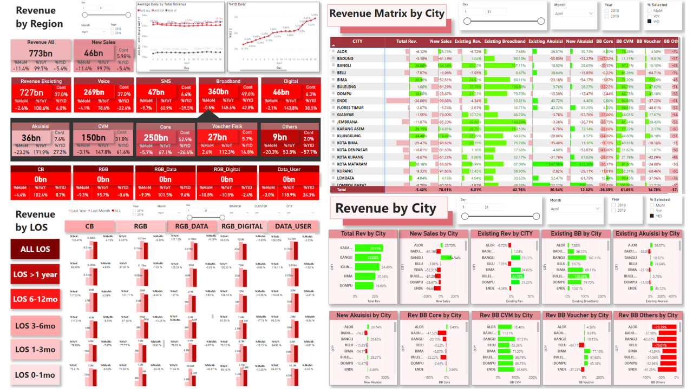
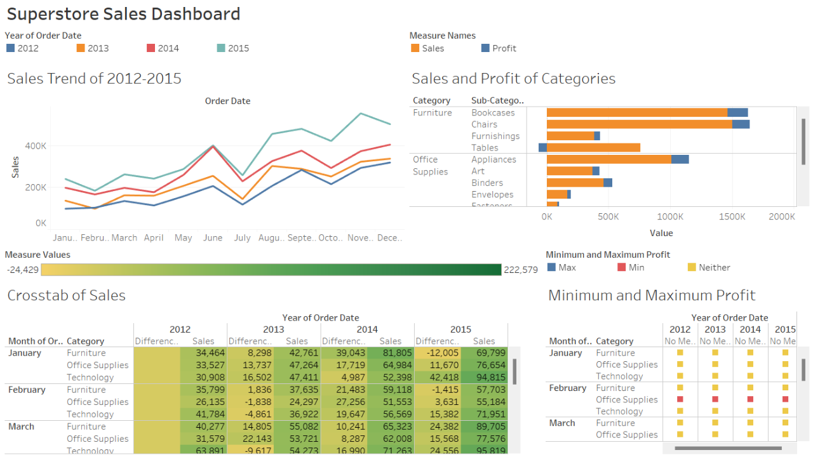
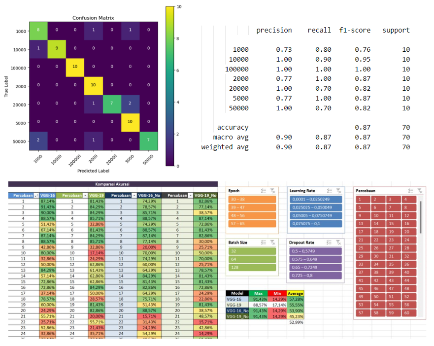
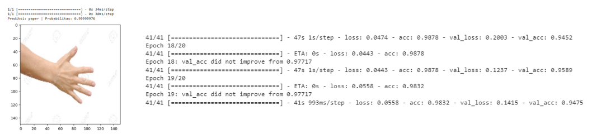
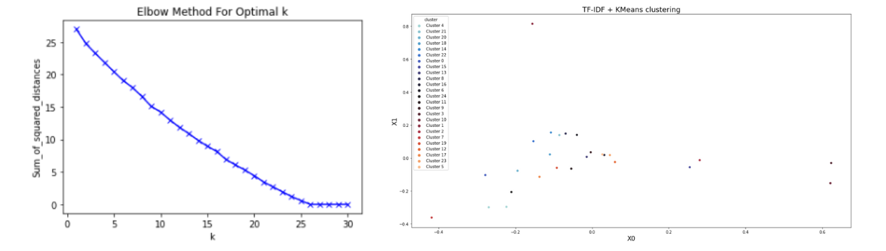
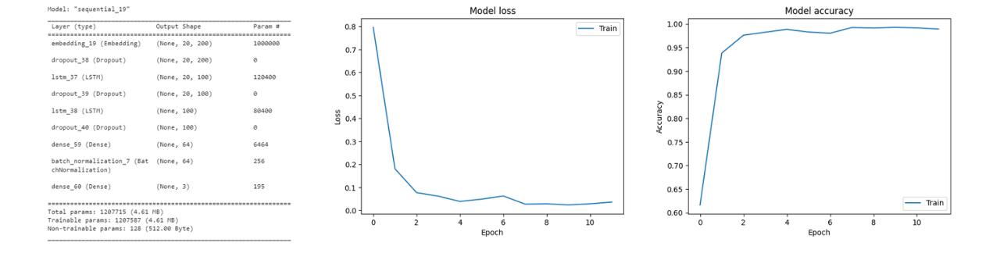
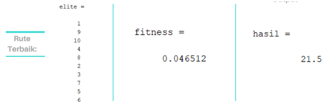

# 
<b>Data Science Portfolio</b>

---

## 
<b>Dashboard</b>

### 1. Telkomsel Revenue Dashboard

This is my project during internship at PT Telekomunikasi Selular (Telkomsel), January 2022-March 2022. After cleaning the dummy dataset using Python and Microsoft Excel, my team and I constructed a comprehensive Region Dashboard which consisted of Region Dashboard, Branch/City Dashboard, Revenue Driver Matrix, and Revenue Driver Bar Chart. The entirety of this dashboard suite was constructed utilizing Microsoft Power BI. 

 

---

### 2. Bike Sharing Dashboard
 |  | 

A bike sharing dashboard was constructed using Python with streamlit library. The development process encompassed essential stages, including data wrangling, data cleaning, Exploratory Data Analysis (EDA), and the creation of insightful data visualizations.

 

---

### 3. Superstore Sales Dashboard

A Superstore Sales Dashboard was developed utilizing Tableau, encompassing data on sales and profits within the Superstore. It consisted of sales and profit of Superstore. Through the analysis using the dashboard, it is evident that sales exhibited a noteworthy improvement in the month of June, irrespective of the year. Notably, the most prominently sold item during this period was phones.

 

---

## 
<b>Image Processing</b>

### 1. Rupiah Paper Currency Recognition Using Image Currency Recognition and CNN

This project combined various hyperparameters: epoch, batch size, learning rate, dropout rate. The scanned dataset consisted of normal, scuffed, dirty, torn, and blurred 2016 and 2022 emision years banknotes. This study showed that VGG-16 with image processing gave the best results with the highest accuracy of 91.43%. VGG-16 with image processing gives the best average accuracy of 57.28%. VGG-19 with image processing followed with an average accuracy of 55.55%, followed by VGG-16 without image processing at 53.90%, and VGG-19 without image processing at 45.23%.

- **Image processing**:
    - Image Enhancement: Histogram Equalization 
    - Image segmentation: Otsu Method
- **Classification**: VGG-16 and VGG-19 model

 

---

### 2. Rock, Paper, Scissor Classification

This project aimed to categorize images into three classes: rock, paper, and scissors. The implemented sequence model demonstrated remarkable performance, achieving an overall accuracy of 98.7% and a validation accuracy of 97.72%.

---

## 
<b>Natural Language Processing (NLP)</b>

### 1. Health Dataset Clustering
 | 

This project used text dataset comprising records of patient consultations with their doctor. Sastrawi Stemmer were applied due to the dataset being in Bahasa Indonesia. Elbow method showed that the optimal k = 5. Consequently, the dataset was partitioned into 25 clusters based on the optimal k-value.

 

---

### 2. Emotion Detection

In this project, emotion classification encompassing joy, anger, and fear was undertaken. A sequential model consisting a Long Short-Term Memory (LSTM) network was constructed. The model achieved an impressive accuracy of 99.16%, with a validation accuracy of 92.17% recorded at the ninth epoch.

 

---

## 
<b>Machine Learning</b>

### 1. Mobile Price Prediction

This project used random forest method with Python. The workflow involved initial data preprocessing, followed by Exploratory Data Analysis (EDA), Feature Selection, and the application of the Random Forest algorithm. Multiple ratios for splitting the dataset were experimented with during the analysis. The project revealed that the most optimal ratio for splitting the dataset was determined to be 80:20. 

 

---

### 2. Determining the Route of Ice Tube Delivery

This project used genetic algorithm to ascertain the optimal route of ice tube delivery. Steps conducted in this project are initialization, population selection, modelling, evaluation and regeneration, and elitism. The entire process was executed utilizing Matlab as the primary tool.

 

---

© 2023 Ardina Dana Nugraha. Powered by Jekyll and the Minimal Theme.
